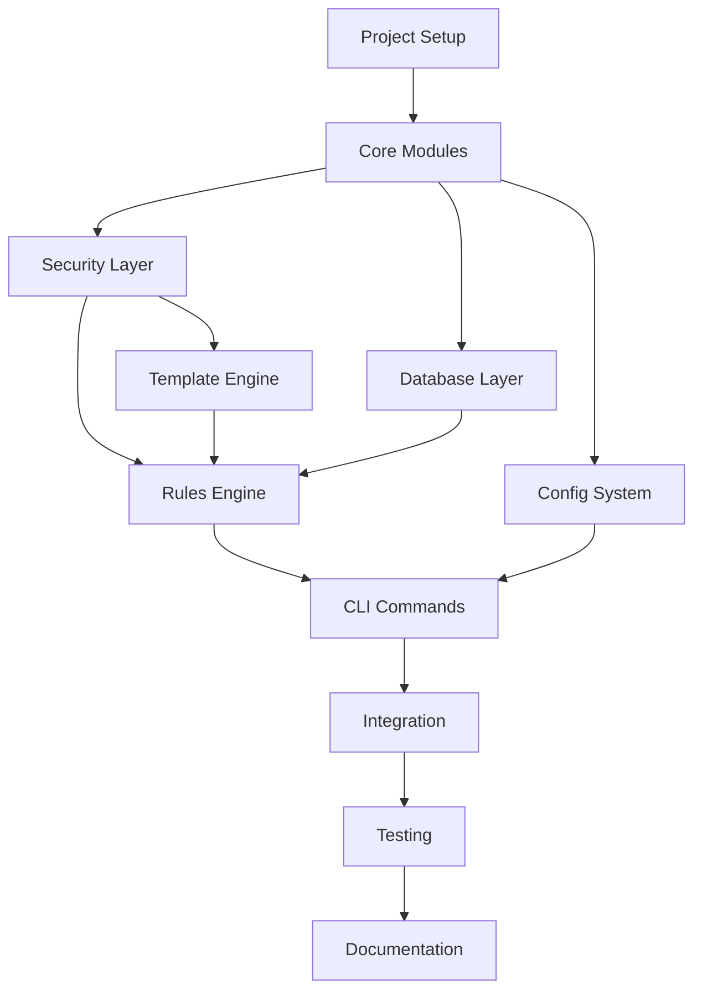

# Sxn Development Work Plan

## Agent Orchestration Strategy

This document outlines the parallel and sequential workstreams for developing the sxn tool using up to 6 concurrent agents. Each agent will report progress to their own status file to avoid write conflicts.

## Progress Tracking System

```
sxn/
├── WORK_PLAN.md (this file - read-only after creation)
├── progress/
│   ├── agent-1-core/
│   │   ├── status.md
│   │   └── tasks/
│   ├── agent-2-security/
│   │   ├── status.md
│   │   └── tasks/
│   ├── agent-3-database/
│   │   ├── status.md
│   │   └── tasks/
│   ├── agent-4-rules/
│   │   ├── status.md
│   │   └── tasks/
│   ├── agent-5-cli/
│   │   ├── status.md
│   │   └── tasks/
│   └── agent-6-testing/
│       ├── status.md
│       └── tasks/
```

## Dependency Graph



## Phase 1: Foundation (Sequential - 1 Agent)

**Agent 1: Core Setup**
```
EPIC-001: Project Foundation
├── 001.001: Initialize gem structure
│   ├── 001.001.001: Create directory structure
│   ├── 001.001.002: Setup gemspec
│   ├── 001.001.003: Configure Bundler
│   └── 001.001.004: Add base dependencies
├── 001.002: Setup testing framework
│   ├── 001.002.001: Configure RSpec
│   ├── 001.002.002: Setup Aruba
│   └── 001.002.003: Add SimpleCov
└── 001.003: Create base module structure
    ├── 001.003.001: lib/sxn.rb
    ├── 001.003.002: lib/sxn/version.rb
    └── 001.003.003: lib/sxn/errors.rb
```

**Duration**: 2 hours
**Output**: Basic gem structure with testing ready

## Phase 2: Core Components (Parallel - 3 Agents)

### Parallel Workstream A: Security & Database

**Agent 2: Security Foundation**
```
EPIC-002: Security Layer
├── 002.001: Path validation system
│   ├── 002.001.001: Create SecurePathValidator class
│   ├── 002.001.002: Implement directory traversal prevention
│   └── 002.001.003: Add symlink validation
├── 002.002: Command execution security
│   ├── 002.002.001: Create SecureCommandExecutor class
│   ├── 002.002.002: Implement command whitelisting
│   └── 002.002.003: Add Process.spawn wrapper
└── 002.003: File operations security
    ├── 002.003.001: Create SecureFileCopier class
    ├── 002.003.002: Implement permission preservation
    └── 002.003.003: Add encryption support
```

**Agent 3: Database Layer**
```
EPIC-003: SQLite Integration
├── 003.001: Database setup
│   ├── 003.001.001: Create SessionDatabase class
│   ├── 003.001.002: Define schema
│   └── 003.001.003: Add migrations
├── 003.002: Session CRUD operations
│   ├── 003.002.001: Implement create_session
│   ├── 003.002.002: Implement list_sessions
│   ├── 003.002.003: Implement update_session
│   └── 003.002.004: Implement delete_session
└── 003.003: Indexing and search
    ├── 003.003.001: Add indexes
    ├── 003.003.002: Implement search
    └── 003.003.003: Add query optimization
```

### Parallel Workstream B: Configuration

**Agent 4: Configuration System**
```
EPIC-004: Configuration Management
├── 004.001: Config discovery
│   ├── 004.001.001: Create ConfigDiscovery class
│   ├── 004.001.002: Implement hierarchical loading
│   └── 004.001.003: Add environment variable support
├── 004.002: Config caching
│   ├── 004.002.001: Create ConfigCache class
│   ├── 004.002.002: Implement TTL logic
│   └── 004.002.003: Add file watcher
└── 004.003: Config validation
    ├── 004.003.001: Schema definition
    ├── 004.003.002: Validation logic
    └── 004.003.003: Error reporting
```

**Duration**: 4 hours (parallel)
**Sync Point**: All agents must complete before Phase 3

## Phase 3: Rules & Templates (Parallel - 2 Agents)

**Agent 2: Template Engine**
```
EPIC-005: Liquid Templates
├── 005.001: Template processor
│   ├── 005.001.001: Create TemplateProcessor class
│   ├── 005.001.002: Integrate Liquid gem
│   └── 005.001.003: Add variable whitelisting
├── 005.002: Template security
│   ├── 005.002.001: Sandbox configuration
│   ├── 005.002.002: Variable sanitization
│   └── 005.002.003: Output validation
└── 005.003: Built-in templates
    ├── 005.003.001: Rails templates
    ├── 005.003.002: JavaScript templates
    └── 005.003.003: Common templates
```

**Agent 3: Rules Engine**
```
EPIC-006: Rules System
├── 006.001: Rule base classes
│   ├── 006.001.001: Create BaseRule class
│   ├── 006.001.002: Define rule interface
│   └── 006.001.003: Add validation hooks
├── 006.002: Rule implementations
│   ├── 006.002.001: CopyFilesRule
│   ├── 006.002.002: SetupCommandsRule
│   └── 006.002.003: TemplateRule
└── 006.003: Rule execution
    ├── 006.003.001: Create RulesEngine class
    ├── 006.003.002: Dependency resolution
    └── 006.003.003: Parallel execution
```

**Duration**: 4 hours (parallel)

## Phase 4: CLI Implementation (Parallel - 3 Agents)

**Agent 1: Core Commands**
```
EPIC-007: Basic CLI Commands
├── 007.001: Init command
│   ├── 007.001.001: Create Init class
│   ├── 007.001.002: Implement folder setup
│   └── 007.001.003: Add interactive prompts
├── 007.002: Session commands
│   ├── 007.002.001: Create Sessions class
│   ├── 007.002.002: Implement add/remove/list
│   └── 007.002.003: Implement use/current
└── 007.003: Project commands
    ├── 007.003.001: Create Projects class
    ├── 007.003.002: Implement add/remove/list
    └── 007.003.003: Add validation
```

**Agent 4: Advanced Commands**
```
EPIC-008: Advanced CLI Commands
├── 008.001: Worktree commands
│   ├── 008.001.001: Create Worktrees class
│   ├── 008.001.002: Implement add/remove/list
│   └── 008.001.003: Add git integration
├── 008.002: Rules commands
│   ├── 008.002.001: Create Rules class
│   ├── 008.002.002: Implement add/list/apply
│   └── 008.002.003: Add template generation
└── 008.003: Debug commands
    ├── 008.003.001: Config debug
    ├── 008.003.002: Session debug
    └── 008.003.003: Performance debug
```

**Agent 5: CLI Infrastructure**
```
EPIC-009: CLI Support Systems
├── 009.001: UI components
│   ├── 009.001.001: Create UI module
│   ├── 009.001.002: Add TTY integration
│   └── 009.001.003: Implement progress bars
├── 009.002: Error handling
│   ├── 009.002.001: Create ErrorHandler
│   ├── 009.002.002: Add recovery suggestions
│   └── 009.002.003: Implement rollback
└── 009.003: Shell completions
    ├── 009.003.001: Bash completion
    ├── 009.003.002: Zsh completion
    └── 009.003.003: Fish completion
```

**Duration**: 6 hours (parallel)

## Phase 5: Testing & Quality (Parallel - 6 Agents)

**Agent 1: Unit Tests - Core**
```
EPIC-010: Core Unit Tests
├── 010.001: Security tests
├── 010.002: Database tests
└── 010.003: Config tests
```

**Agent 2: Unit Tests - Rules**
```
EPIC-011: Rules Unit Tests
├── 011.001: Template tests
├── 011.002: Rules engine tests
└── 011.003: Language detection tests
```

**Agent 3: Integration Tests**
```
EPIC-012: Integration Tests
├── 012.001: Session lifecycle tests
├── 012.002: Worktree creation tests
└── 012.003: Rule application tests
```

**Agent 4: CLI Tests**
```
EPIC-013: CLI Acceptance Tests
├── 013.001: Aruba feature tests
├── 013.002: Command interaction tests
└── 013.003: Error scenario tests
```

**Agent 5: Performance Tests**
```
EPIC-014: Performance Tests
├── 014.001: Benchmark tests
├── 014.002: Load tests
└── 014.003: Memory profiling
```

**Agent 6: Security Audit**
```
EPIC-015: Security Validation
├── 015.001: Injection tests
├── 015.002: Path traversal tests
└── 015.003: Permission tests
```

**Duration**: 4 hours (parallel)

## Phase 6: Integration & Documentation (Sequential - 2 Agents)

**Agent 1: Final Integration**
```
EPIC-016: System Integration
├── 016.001: Component integration
├── 016.002: End-to-end testing
└── 016.003: Performance optimization
```

**Agent 2: Documentation**
```
EPIC-017: Documentation
├── 017.001: README.md
├── 017.002: User guide
├── 017.003: API documentation
└── 017.004: MCP integration guide
```

**Duration**: 3 hours

## Synchronization Points

1. **After Phase 1**: Single agent completes foundation
2. **After Phase 2**: Security, Database, Config must sync
3. **After Phase 3**: Templates and Rules must integrate
4. **After Phase 4**: All CLI components merge
5. **After Phase 5**: Test results consolidation
6. **After Phase 6**: Final review and release

## Agent Communication Protocol

### Status Reporting
Each agent updates their `progress/agent-N-role/status.md`:
```markdown
# Agent N Status

## Current Task
EPIC-XXX.YYY.ZZZ: Task description

## Status
IN_PROGRESS | COMPLETED | BLOCKED

## Progress
Started: 2025-01-16T10:00:00Z
Updated: 2025-01-16T10:30:00Z
Completed: -

## Output
- Created: lib/sxn/security/path_validator.rb
- Tests: spec/unit/security/path_validator_spec.rb
- Coverage: 100%

## Notes
Any relevant notes or blockers
```

### Task Handoff
When completing a task that another agent depends on:
1. Update own status.md with COMPLETED
2. Create handoff file: `progress/handoffs/EPIC-XXX-to-YYY.md`
3. Next agent picks up from handoff file

### Conflict Resolution
- Each agent works in separate module directories
- Shared interfaces defined upfront in `lib/sxn/interfaces/`
- Integration points tested with contract tests

## Success Metrics

### Phase Completion Criteria
- All tasks marked COMPLETED
- Test coverage > 90% per module
- Security tests passing
- Performance benchmarks met
- No blocking issues

### Quality Gates
1. **Security Gate**: No injection vulnerabilities
2. **Performance Gate**: All operations under target times
3. **Coverage Gate**: 95% for critical, 90% overall
4. **Integration Gate**: All components work together
5. **Documentation Gate**: All features documented

## Risk Mitigation

### Agent Failure
- If an agent fails, reassign tasks to available agents
- Critical path tasks get priority
- Non-critical tasks can be deferred

### Integration Issues
- Daily integration tests (even during development)
- Contract tests between components
- Rollback capability for each phase

### Timeline Slippage
- Core security features are non-negotiable
- UI polish can be deferred
- Advanced features can move to v2

## Total Timeline

- **Phase 1**: 2 hours (sequential)
- **Phase 2**: 4 hours (parallel)
- **Phase 3**: 4 hours (parallel)
- **Phase 4**: 6 hours (parallel)
- **Phase 5**: 4 hours (parallel)
- **Phase 6**: 3 hours (sequential)
- **Total**: ~23 hours with 6 agents
- **Actual**: ~2-3 days with integration and review

## Next Steps

1. Create progress directory structure
2. Initialize agent status files
3. Begin Phase 1 with Agent 1
4. Monitor progress and adjust as needed